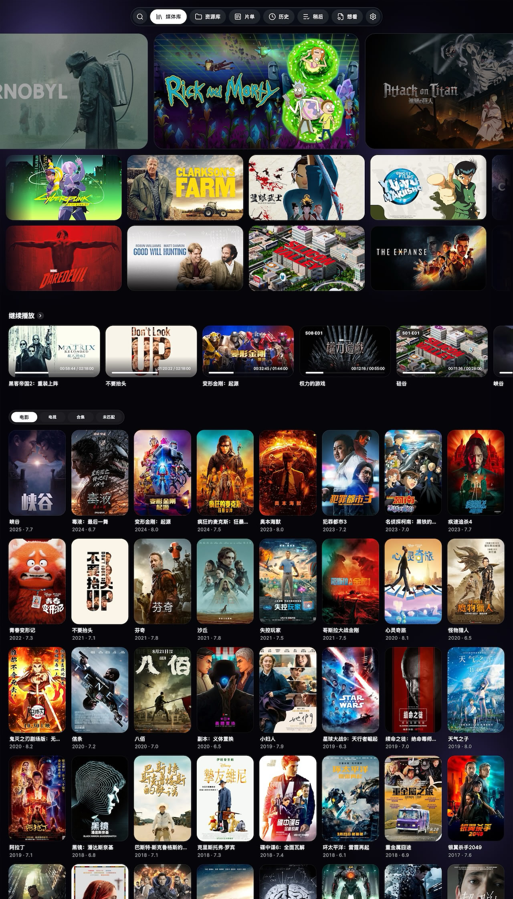
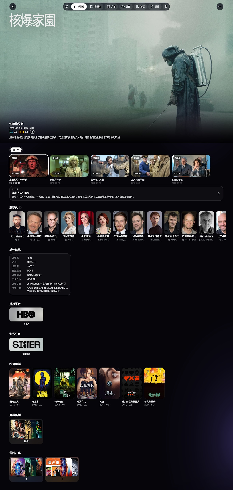
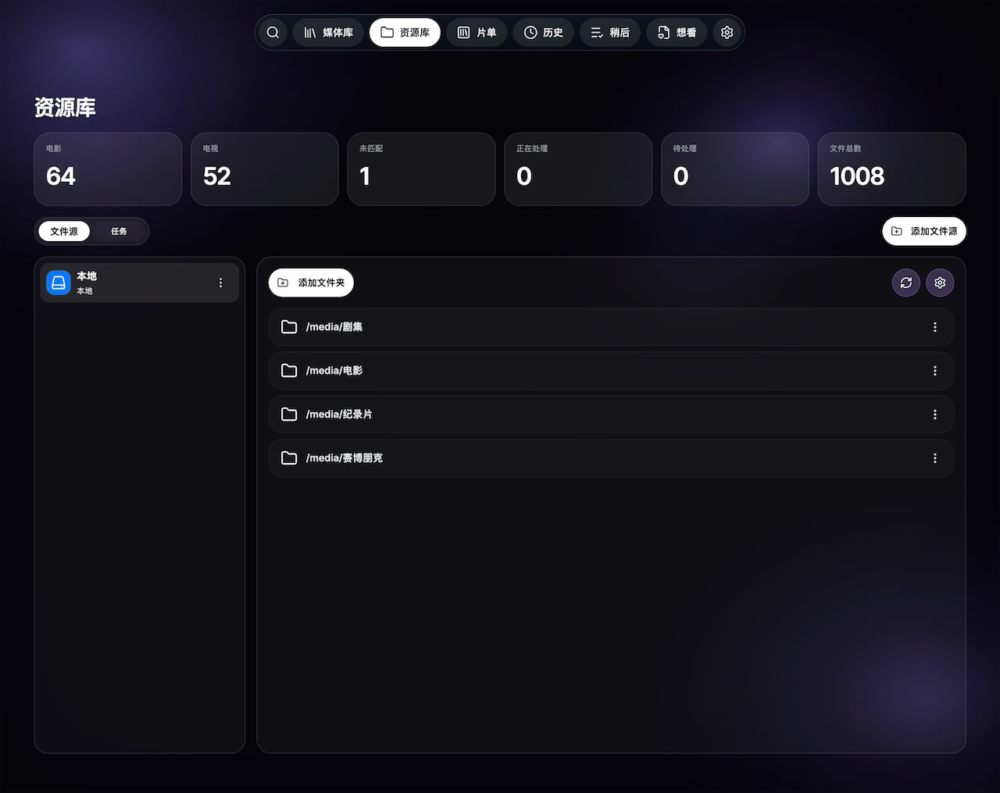

# Cinemore Server

[English](./README.md) | **简体中文**

[官网](https://cinemore.com.cn/server)

Cinemore Server 是一个面向个人媒体库管理与播放的高性能、跨平台服务端程序，适合本地存储、NAS 和云盘等多种媒体场景。它可以将分散的视频资源统一整理为私有媒体库，并为多端提供一致的播放与管理体验。

## 功能特性

- 统一管理本地、NAS 和云盘中的媒体资源
- 支持电影、电视剧以及多个媒体目录挂载
- 支持 Docker、Docker Compose 和命令行二进制部署
- 支持 PostgreSQL 和 SQLite 两种存储方式
- Docker 镜像内已包含 FFmpeg，部署更省心

## 目录

- [界面预览](#界面预览)
- [快速开始](#快速开始)
- [部署方式对照](#部署方式对照)
- [目录映射说明](#目录映射说明)
- [访问服务](#访问服务)
- [命令行启动方式](#命令行启动方式)
- [FFmpeg 依赖说明](#ffmpeg-依赖说明)
- [说明](#说明)

## 界面预览

### 首页



### 详情页



### 资源库



## 快速开始

### 使用 Docker 命令

```bash
docker run -d \
  --name cinemore-server \
  -p 8000:8000 \
  -v /path/to/data:/app/data \
  -v /path/to/media:/media/xx \
  cinemore/cinemore-server:latest
```

### 使用 Docker Compose

```bash
docker-compose -f docker-compose.yml up -d

# 使用 SQLite 版本
docker-compose -f docker-compose-sqlite.yml up -d
```

## 部署方式对照

| 方式 | 适用场景 | 启动命令 | 默认访问端口 | 应用数据目录 | 媒体目录 | 额外依赖 |
|---|---|---|---|---|---|---|
| Docker | 大多数用户 | `docker run ...` | `8000` | `/app/data` | `/media/...` | 无 |
| Docker Compose（PostgreSQL） | 持久化正式部署 | `docker-compose -f docker-compose.yml up -d` | `8080` | `./data` | `./media` | 无 |
| Docker Compose（SQLite） | 轻量部署 | `docker-compose -f docker-compose-sqlite.yml up -d` | `8080` | `./data` | `./media` | 无 |
| 命令行二进制 | 本地开发、调试、手动集成 | `./cinemore-server-linux-amd64 ...` | `8080` | `./data` | 自定义路径 | 需要 FFmpeg |

说明：

- `docker-compose.yml` 默认使用 PostgreSQL
- `docker-compose-sqlite.yml` 使用 SQLite，更适合轻量场景

## 目录映射说明

### 配置文件目录 (`/app/data`)

- **用途**：存储配置文件、数据库文件
- **映射**：`/path/to/data:/app/data`
- **说明**：建议映射到持久化存储，防止容器删除后丢失数据
- **Compose 默认值**：`./data:/app/data`

### 媒体文件目录 (`/media`)

- **用途**：存储电影、电视剧等媒体文件
- **映射**：`/path/to/media:/media/xx`
- **说明**：映射到您的媒体文件存储目录
- **Compose 默认值**：`./media:/media`

### 多路径映射示例

```yaml
volumes:
  - /path/to/1:/media/movies1
  - /path/to/2:/media/movies2
  - /path/to/3:/media/tv1
  - /path/to/4:/media/tv2
```

注意事项：

1. 如果只有一个媒体目录，可以使用 `/volume/medias:/media`
2. 多路径映射时，每个路径在容器内必须有唯一的子目录名
3. `docker-compose.yml` 默认会将 PostgreSQL 数据保存到 `./data/postgresql`

## 访问服务

启动成功后，访问：

- 使用 `docker run` 启动时：`http://ip:8000`
- 使用 `docker-compose.yml` 或 `docker-compose-sqlite.yml` 启动时：`http://ip:8080`

## 命令行启动方式

如果你使用的是二进制可执行文件，可以直接运行：

```bash
./cinemore-server-linux-amd64 --data="./data" --port="8080" --media="/path/to/media"
```

也可以指定配置文件：

```bash
./cinemore-server-linux-amd64 --config="/xxx/config.yaml"
```

### 参数说明

根据当前代码中的参数定义，可用启动参数如下：

```text
--data <path>       设置配置目录，默认值：./data
--port <port>       设置 HTTP 监听端口，默认值：8080
--media <path>      设置本地媒体根目录，默认值：/
--config <path>     设置 config.yaml 的完整文件路径
--version           显示版本信息
```

说明：

- `--data` 用于指定数据目录，适合存放配置文件、数据库等内容
- `--config` 是指定一个确切的配置文件路径，例如 `/xxx/config.yaml`
- `--media` 指向媒体根目录后，程序会在该目录下扫描或访问本地媒体文件
- 如果只想查看版本，可执行 `./cinemore-server-linux-amd64 --version`

命令行方式启动后，默认访问地址为：

`http://ip:8080`

如果你通过 `--port` 指定了其他端口，请将访问地址中的端口替换为对应值。

## FFmpeg 依赖说明

- Docker 镜像中已经内置 FFmpeg，无需额外安装
- 命令行运行二进制时，需要在宿主机中提前安装 FFmpeg
- 建议使用 `FFmpeg 8.1` 或更高版本

如果你希望通过源码编译方式安装 FFmpeg，可参考下面的示例：

```bash
export FFMPEG_VERSION=8.1

wget -q https://ffmpeg.org/releases/ffmpeg-${FFMPEG_VERSION}.tar.gz
tar -xzf ffmpeg-${FFMPEG_VERSION}.tar.gz
cd ffmpeg-${FFMPEG_VERSION}

ARCH=$(uname -m)
if [ "$ARCH" = "x86_64" ]; then
    export CFLAGS="-march=x86-64 -mtune=generic"
    export CXXFLAGS="-march=x86-64 -mtune=generic"
elif [ "$ARCH" = "aarch64" ]; then
    export CFLAGS="-march=armv8-a"
    export CXXFLAGS="-march=armv8-a"
fi

./configure \
  --prefix=/usr/local \
  --enable-shared \
  --disable-static \
  --disable-doc \
  --disable-programs
make -j$(nproc)
make install

echo "/usr/local/lib" | sudo tee /etc/ld.so.conf.d/local.conf > /dev/null
sudo ldconfig
```

补充说明：

- 上面的编译参数包含 `--disable-programs`，因此更适合安装 FFmpeg 运行库
- 如果你还需要系统里直接可用的 `ffmpeg` 命令，请改用系统包管理器安装，或在自行编译时移除 `--disable-programs`

## 说明

- Docker 方式更适合大多数用户，部署简单且依赖完整
- 命令行方式更适合本地调试、开发或手动集成场景
- 如果你准备公开给其他用户使用，建议优先提供 Docker 方式作为默认文档入口
